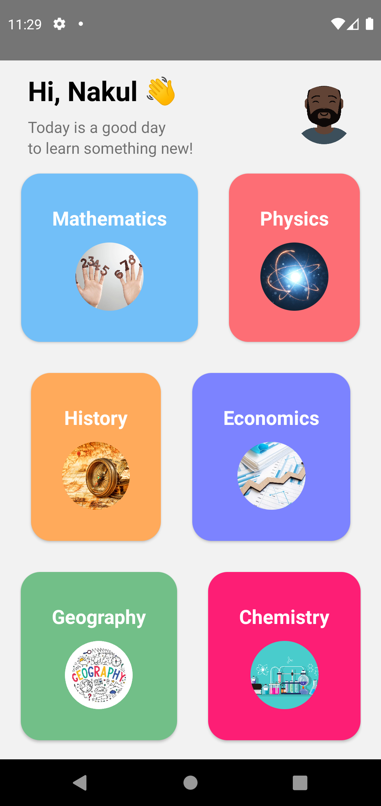

<h1><strong>This project was awarded 12th position out of 200 projects in <a href="https://www.scaler.com/event/hackx">HackX Scalar Hackathon</a></strong> </h1>

<strong>I will be continuing with this project to help our society! Any contributor is most welcome! 💖</strong>

## Problem Tackled

Even before the pandemic, the literacy rate of the deaf was low, now since only E-Learning is taking place there are not many resources for the deaf to learn and understand. Thus, this condition is affecting them the most. 

## Solution Proposed 

To tackle this problem I have come up with a solution of teaching elementary subjects through a mobile application. This application will have various subjects being taught in elementary school, each topic will have a tutorial attached to it. The tutorial will have teachers teaching using sign language and the captions of the video will be present. At the end of each tutorial, there will be a quiz for the user to challenge what it has learned.

## Impact

1. Increasing the literacy rate.
2. Creating awareness among people regarding this problem.
3. Can be adopted by 
   1. Parents
   2. Deaf Orphanages

## Future Prospects

1. Increasing number of elementary school subject tutorials.
2. Encouraging more interpreters/teachers to contribute. 

## Demo Link
<a href="https://drive.google.com/file/d/1zo4TYn8DuuFpwEFOcd1uqU2sFskle5z7/view?usp=sharing"> LINK </a>

## Screenshots

